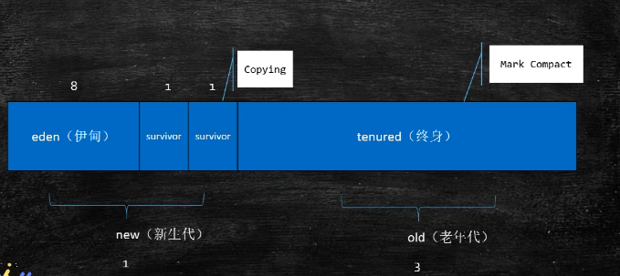
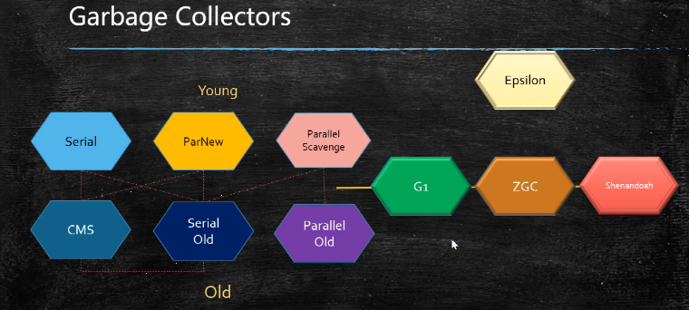

## GC和GC Tuning

#### GC基础知识

1. ##### 什么是垃圾

   没有任何引用指向的对象

2. ##### 如何定位垃圾

   引用计数（不能解决循环依赖的多个垃圾对象）

   根可达算法

   ```
   都有那些对象是属于根？
   线程池变量、静态变量、常量池、JNI指针
   ```

3. ##### 常见垃圾回收算法

   - Mark-Sweep(标记清除法)

     ```
     位置不连续
     产生碎片
     ```

   - Copying

     ```
     没有碎片
     浪费空间
     ```

   - Mark-Compact(标记压缩)

     ```
     效率低
     没有碎片
     ```

4. ##### JVM内存分代模型（用于分代垃圾回收算法）

   - 部分垃圾回收器使用的模型
   - 新生代 + 老年代 + 永久代（1.7）/ 元数据区（1.8）
     - 永久代和元数据都是装载Class对象的
     - 永久代必须指定大小限制，元数据区可以设置也可以不设置，无上限（受限于物理内存）
     - 字符串常量 1.7 ==> 永久代；1.8 ==>堆
     - 方法区是一个逻辑概念 ==>永久代、元数据区
   - 堆内存逻辑分区
   - 新生代=eden+2个survivor区  
     - YGC回收之后，大多数对象会被回收，活着的对象会进入s0
     - 再次YGC,活着的对象eden + s0 -->s1
     - 再次YGC， eden + s1 --> s0
     - 年龄足够，进入老年代
     - s区装不下，进入老年代
   - 老年代
     - 老年代满了触发FGC Full GC
     - 存放的是顽固分子
   - 调优的目的
     - 减少FGC
     - MinorGC = YGC
     - MajorGC = FGC

5. ##### 常见的垃圾回收器

   

   - Serial 年轻代 串行回收
   - PS 年轻代 并行回收
   - ParNew 年轻代 配合CMS的并行回收
   - SerialOld 老年代
   - ParallelOld 老年代
   - ConcurrentMarkSweep 老年代  并发的，垃圾回收和应用程序同时运行，降低STW的时间（200ms）
   - G1(10ms)
   - ZGC(1ms)

   1.8默认的垃圾回收：PS + ParallelOld

6. ##### JVM调优第一步，了解生产环境下的垃圾回收器组合

   - JVM的命令行参数参考：[参考网站](https://chriswhocodes.com/graalvm_ce_jdk8_options.html)，[官方文档](https://docs.oracle.com/javase/8/docs/technotes/tools/windows/java.html)

   - JVM参数分类

     >标准： -开头，所有的HotSpot都支持
     >
     >非标准：-X开头，特定版本的HotSpot支持特定命令
     >
     >不稳定：-XX开头，下个版本可能取消

   常用命令：

   java -XX:+PrintFlagsFinal					   [设置值（最终生效值）]

   java -XX:+PrintFlagsInitail					  [默认值]

   java -XX:+PrintCommandLineFlags	  [命令行参数]


#### 调优命令

```bash
#打印堆栈信息 ， 追查死锁
jstack <PID> 
```

```bash
#打印虚拟机的一些信息
jinfo <PID> 
```

```bash
#动态观察gc情况
jstat -gc <PID>
#每隔五百毫秒打印gc的情况
jstat -gc <PID> 500
```

```bash
#查看有多少对象产生
jmap -histo <PID> | head -20
#jmap执行期间会对进程产生很大影响，甚至卡顿
	#1.设定了参数HeadDump，OOM的时候回自动产生对转储文件
	#2.很多服务器备份，停掉这台不影响其他
	#3.在线定位
```

工具

[arthas教程](https://blog.csdn.net/u013735734/article/details/102930307)